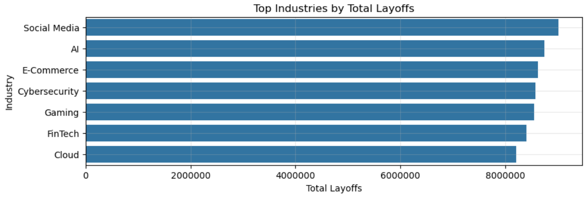
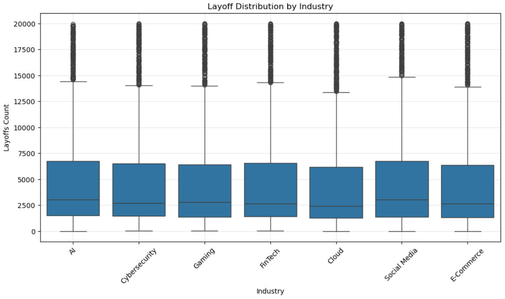
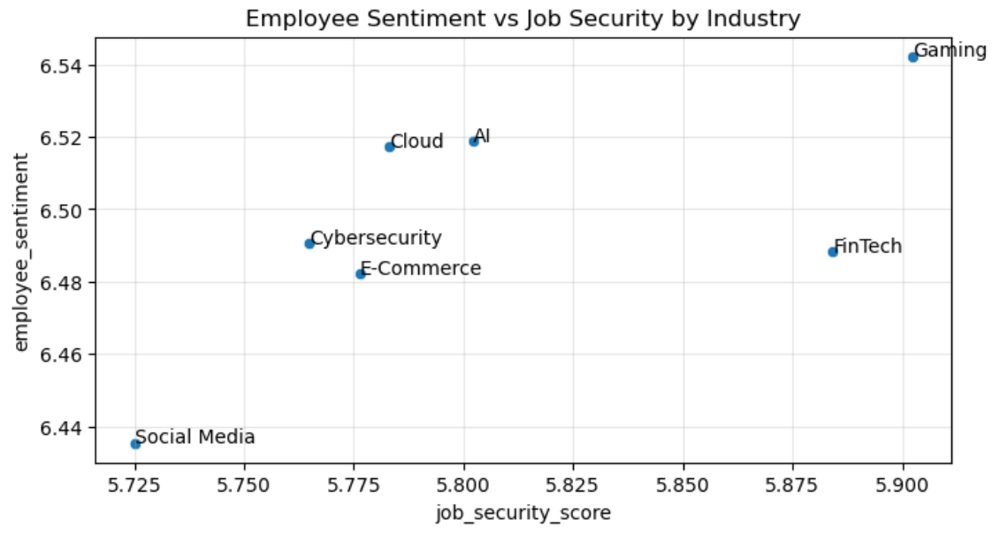
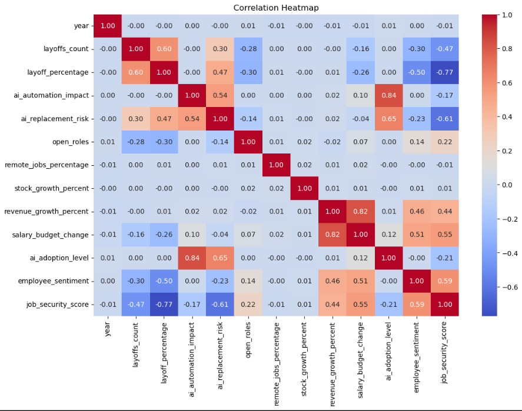

# AI and Workforce Layoffs Analysis

## Project Overview

This project analyzes workforce layoffs across industries between 2024 and 2026. The analysis focuses on layoffs, AI adoption, AI replacement risk, employee sentiment, job security, hiring trends, market conditions, and company performance.

The project includes both:

* Exploratory Data Analysis (EDA)
* Machine Learning model development for layoff count prediction

The main objective is to understand workforce transformation trends and build a regression model that predicts `layoffs_count` using company, financial, workforce, hiring, and AI-related features.

---

## Dataset Overview

The dataset contains **12,000 records** and **23 features** related to layoffs, hiring activity, AI adoption, automation impact, employee sentiment, job security, market condition, and company performance across multiple industries.

### Key Variables

* Layoffs Count
* Layoff Percentage
* AI Adoption Level
* AI Replacement Risk
* AI Automation Impact
* Employee Sentiment
* Job Security Score
* Revenue Growth
* Stock Growth
* Open Roles
* Remote Jobs Percentage
* Salary Budget Change
* Market Condition
* Hiring Trend

---

## Tools and Technologies Used

* Python
* Pandas
* NumPy
* Matplotlib
* Seaborn
* Scikit-Learn
* Jupyter Notebook
* Git
* GitHub

---

## Project Workflow

### Exploratory Data Analysis

1. Data Loading
2. Data Cleaning
3. Dataset Overview
4. Statistical Analysis
5. Data Visualization
6. Correlation Analysis
7. Business Insight Generation

### Machine Learning

1. Problem Definition
2. Feature Selection
3. Feature Engineering
4. Categorical Encoding
5. Train-Test Split
6. Feature Scaling
7. Model Building
8. Model Evaluation
9. Model Comparison
10. Feature Importance Analysis

---

## Skills Demonstrated

* Data Cleaning
* Exploratory Data Analysis
* Data Visualization
* Correlation Analysis
* Feature Selection
* Feature Engineering
* Categorical Encoding
* Feature Scaling
* Regression Modeling
* Model Evaluation
* Model Comparison
* Feature Importance Analysis
* Business Insight Generation
* Git and GitHub

---

## Key EDA Findings

1. Social Media and AI industries experienced the highest workforce reductions.
2. Layoffs remained relatively stable between 2024 and 2026.
3. Layoff distributions were highly right-skewed, with a few companies experiencing extremely large workforce reductions.
4. AI, Cloud, and Gaming industries showed high AI adoption while maintaining relatively strong employee sentiment.
5. Job security score showed the strongest negative relationship with layoffs.
6. Employee sentiment decreased as layoffs increased.
7. AI replacement risk showed a moderate positive relationship with layoffs.
8. AI adoption level showed almost no direct relationship with layoffs.
9. Social Media displayed the widest variation in layoff activity.
10. Open roles were negatively correlated with layoffs.

---

## Visualizations

### Top Industries by Total Layoffs



### Layoff Distribution



### Employee Sentiment vs Job Security



### Correlation Heatmap



---

## Machine Learning Model: Layoff Count Prediction

A machine learning model was built to predict `layoffs_count` using company, financial, workforce, hiring, market, and AI-related features.

This is a **regression problem** because the target variable is numeric.

### Target Variable

```text
layoffs_count
```

### Feature Selection

Some columns were removed before model training:

* `record_id` — unique identifier, not useful for prediction
* `company_name` — identifier that may cause memorization
* `layoff_percentage` — may introduce data leakage
* `reason_for_layoffs` — post-event information, not suitable for prediction

---

## Feature Engineering

New features were created to improve model learning:

### AI Workforce Pressure

```text
ai_workforce_pressure = ai_adoption_level × ai_replacement_risk
```

This feature captures the combined effect of AI adoption and AI replacement risk.

### Financial Health

```text
financial_health = revenue_growth_percent + salary_budget_change
```

This feature represents the company’s financial condition using revenue growth and salary budget change.

### Hiring Strength

```text
hiring_strength = open_roles × hiring_trend
```

This feature captures the combined effect of available job openings and hiring activity.

---

## Models Used

Three regression models were trained and compared:

1. Linear Regression
2. Decision Tree Regressor
3. Random Forest Regressor

---

## Model Performance

| Model                   |     MAE |    RMSE | R² Score |
| ----------------------- | ------: | ------: | -------: |
| Linear Regression       | 2705.57 | 3741.90 |   0.4678 |
| Decision Tree Regressor | 3190.43 | 4796.70 |   0.1255 |
| Random Forest Regressor | 2405.28 | 3476.41 |   0.5406 |

---

## Best Model

The **Random Forest Regressor** performed the best among the three models.

It achieved:

* Lowest MAE
* Lowest RMSE
* Highest R² Score

The Random Forest model achieved an **R² score of 0.5406**, meaning it explained around **54% of the variation** in `layoffs_count`.

The MAE value of **2405.28** means the model’s predictions were off by around **2405 layoffs on average**.

---

## Feature Importance Insight

The Random Forest model identified `market_condition` as the most important feature for predicting layoffs.

This suggests that overall market conditions such as recession, stable market, or bull market strongly influence workforce reduction decisions.

Other important features included:

* Stock Growth Percent
* Remote Jobs Percentage
* Open Roles
* Salary Budget Change
* AI Automation Impact
* Employee Sentiment
* Revenue Growth Percent
* Job Security Score
* Financial Health

---

## Business Insights

The analysis shows that layoffs are not caused by a single factor. Workforce reductions are influenced by a combination of market conditions, company financial health, hiring activity, employee sentiment, job security, and AI-related impact.

AI-related features were useful for prediction, but AI adoption alone was not the strongest driver of layoffs. Market condition had the highest influence in the Random Forest model.

This indicates that broader economic and business conditions play a major role in workforce reduction decisions.

---

## Project Structure

```text
AI-Workforce-Layoffs-Analysis/
│
├── layoffs_analysis.ipynb
├── layoff_count_prediction.ipynb
├── tech_layoffs_hiring_trends_elite_v2.csv
├── README.md
├── requirements.txt
└── images/
    ├── top_industries.PNG
    ├── layoff_distribution.PNG
    ├── sentiment_vs_security.PNG
    └── heatmap.PNG
```

---

## Conclusion

This project performed exploratory data analysis and machine learning modeling on workforce layoffs data from 2024 to 2026.

The EDA showed that layoffs vary across industries and are connected with job security, employee sentiment, AI replacement risk, open roles, and market conditions.

The machine learning section built and compared three regression models. Random Forest Regressor performed the best with an R² score of 0.5406.

The project concludes that layoffs are influenced by multiple factors, including market conditions, financial performance, workforce sentiment, hiring activity, job security, and AI-related transformation.
